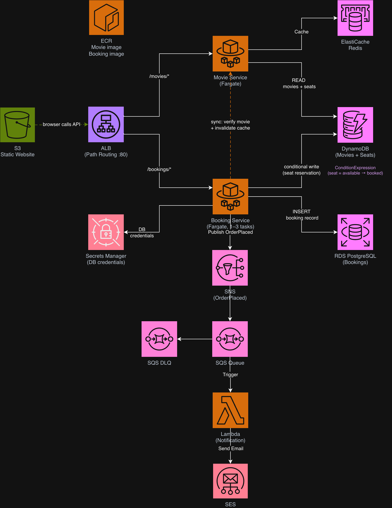

# CineTicket — ECS Fargate Microservices



> Build a real microservices platform: two Fargate services, a shared cache, a relational database, and an event-driven notification pipeline — all without managing servers.

## What you'll deploy

- **ECS Fargate cluster** — two containerised services (Movie Service + Booking Service) behind a single ALB with path-based routing
- **ALB** — routes `/movies/*` to Movie Service and `/bookings/*` to Booking Service
- **ElastiCache Redis** — Movie Service caches DynamoDB reads; cache-aside pattern in Python
- **DynamoDB** — `cineticket-movies` (catalogue) + `cineticket-seats` (seat availability with conditional writes)
- **RDS PostgreSQL** — booking records (confirmed reservations)
- **SNS + SQS + Lambda** — Booking Service publishes `OrderPlaced` to SNS; SQS queues the event; Lambda sends a confirmation email via SES
- **ECR** — private container registry for both service images
- **Secrets Manager** — RDS credentials; injected into containers at runtime
- **Application Auto Scaling** — Booking Service scales 1 → 3 tasks when CPU exceeds 60%
- **S3** — static web UI

## What you'll learn

- Fargate task definitions, task roles vs. execution roles, and container port mappings
- ALB path-based routing rules to a single entry point for multiple services
- Cache-aside pattern with ElastiCache Redis
- DynamoDB conditional writes for seat reservation (optimistic concurrency)
- SNS fan-out → SQS → Lambda event pipeline
- Building and pushing Docker images to ECR
- ECS service auto scaling on CloudWatch CPU metrics

## Quick start

1. **Prerequisites:** AWS account (us-east-1), VPC from [aws-cfn-snippets](https://github.com/BoldFellow/aws-cfn-snippets) (`vpc-cidr-getaz-outputs-db-subnets.yaml`), Docker Desktop installed and running, AWS CLI configured
2. **Deploy this stack** — follow [guide.md](guide.md) for the full console walkthrough, or use the CFN shortcut (Appendix A in guide.md):
   ```bash
   aws cloudformation deploy \
     --template-file cfn/template.yaml \
     --stack-name cineticket \
     --capabilities CAPABILITY_IAM \
     --parameter-overrides VpcStackName=VPCs
   ```
3. **Build and push container images** — see guide.md §7 (ECR) for the `docker build` + `docker push` commands
4. **Bootstrap schema** — run the one-liner in guide.md §5 to apply `app/services/bookings/schema.sql` via ECS Exec

## What you'll destroy at cleanup

```bash
aws cloudformation delete-stack --stack-name cineticket
```

**Manual cleanup required:**
- Delete ECR repositories and their images (CloudFormation cannot delete non-empty repositories)
- Empty and delete the S3 web bucket

**Estimated cost while running:** ~$5–$8/day (RDS `db.t3.micro` ~$1.50/day + ElastiCache `cache.t3.micro` ~$1.20/day + Fargate tasks ~$0.50–$1.00/day + NAT Gateway ~$1.10/day)

**After cleanup:** zero ongoing cost

## Files

| File | Purpose |
|---|---|
| `architecture.png` / `architecture.drawio` | System diagram |
| `cfn/template.yaml` | CloudFormation template — full stack (Appendix A shortcut) |
| `guide.md` | Full console walkthrough |
| `app/services/movies/` | Movie Service — Flask app, Dockerfile, requirements |
| `app/services/bookings/` | Booking Service — Flask app, Dockerfile, requirements, schema.sql |
| `app/lambdas/notification/lambda_function.py` | Lambda — sends booking confirmation emails via SES |
| `app/web/index.html` | Static cinema booking web UI |
| `app/web/app.zip` | Web UI deployment package |

## License

MIT — see [LICENSE](LICENSE).
